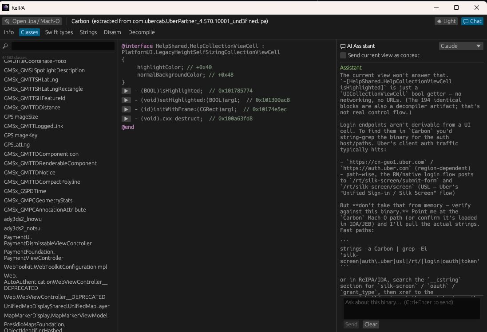

# ReIPA

For **APK** please visit https://github.com/JRBusiness/REapk

An iOS Mach-O toolkit written in Rust: a loader, an arm64 disassembler Objective-C and Swift metadata recovery, decompiler, and a native desktop explorer. It reads decrypted App Store binaries directly, with no dependency on Ghidra, IDA, radare2, or LLVM.


## Why it exists

The usual tools for this job are either slow on the large binaries that ship in modern apps, or they pull in a heavy framework you have to install and manage. ReIPA parses the Mach-O itself, walks the Objective-C and Swift metadata itself, and decodes arm64 itself. On a 300 MB DoorDash binary it dumps every Objective-C class in about a second where `rabin2 -c` takes couple seconds. 


## Building

You need a recent stable Rust toolchain.

```
cargo build --release
```

The CLI lands at `target/release/reipa`. The desktop app is `reipa-gui`, and it shells out to the `reipa` and `reipa-bench` executables, so keep all three in the same directory (the release build already does this).

## Command-line use

Run `verify` first to check whether the binary is decrypted:

```
reipa verify   MyApp.ipa
reipa info     MyApp.ipa
reipa symbols  MyApp.ipa
reipa strings  MyApp.ipa
reipa objc     MyApp.ipa
reipa classdump MyApp.ipa
reipa swift-types MyApp.ipa
reipa disasm    MyApp.ipa 0x100004380
reipa decompile MyApp.ipa 0x100004380
```

`disasm` and `decompile` take a start address and stop at the function's return or an instruction cap (`--count`, default 256 and 512 respectively).

### A note on FairPlay

App Store binaries are encrypted until the device decrypts them at launch. If `__TEXT` is still ciphertext, disassembly produces garbage, so `verify` checks the `cryptid` flag and says so plainly. To analyze an encrypted binary, dump a decrypted copy from a device first (frida-ios-dump, bagbak, and similar) and run ReIPA against that.

## Desktop app

`reipa-gui` is a native window built on egui. Open an `.ipa` and it extracts the executable for you; open a raw Mach-O and it reads it directly. It has:

- A dark theme by default, with a light toggle in the top bar.
- Tabs for header info, classes (a searchable sidebar with an `@interface` view and a per-method jump-to-decompile), Swift types, strings, disassembly, and the decompiler.
- Syntax highlighting on the disassembly and pseudocode views.
- A FairPlay banner that runs `verify` on open so you know up front whether the binary is decrypted.
- A chat panel on the right that talks to the `claude` or `codex` CLI if you have one installed. It can send the current view (a decompiled function, a class dump, the header) along as context, so you can ask questions about what you are looking at without copying and pasting.

The heavy parsing runs on a background thread, so the window stays responsive hile a 250 MB binary loads.


## Limitations

The decompiler is working but still in early development. It builds a CFG, recovers conditions from flag setting instructions, structures if/else and loops where it can prove the region is clean, and names functions from Objective-C method implementations. What it does not have yet: full SSA, type recovery, and register-level variable naming.

Other known gaps: arm64e pointer authentication in chained fixups is not decoded, Swift protocol names with punycode or complex generics fall back to their raw mangled form, and imported-module parent pointers in Swift type descriptors are not dereferenced.

## Tests

```
cargo test --workspace
```

The arm64 decoder, the Objective-C and Swift metadata paths, and the loader all have unit and snapshot coverage. The decoder is additionally validated against Capstone on full binaries through the benchmark harness.
